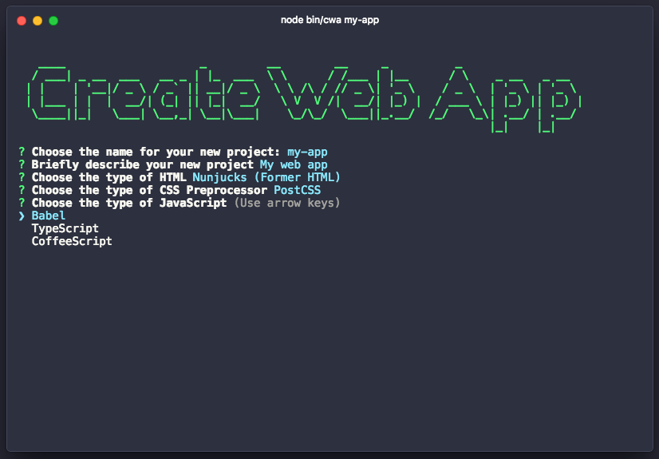

# Create Web App

> The easiest way to create a web application with server-side rendering



## Overview

```
$ npm install -g create-web-app

$ cwa my-app
$ cd my-app
$ npm run dev
```

## Support

### HTML
- [Nunjucks](https://mozilla.github.io/nunjucks/)
- [Pug](https://pugjs.org/)

### CSS Preprocessor
- [PostCSS](http://postcss.org/)
- [Sass](http://sass-lang.com/)
- [Less](http://lesscss.org/)

### JavaScript
- [Babel](https://babeljs.io/)
- [TypeScript](https://www.typescriptlang.org)
- [CoffeeScript](http://coffeescript.org/)
